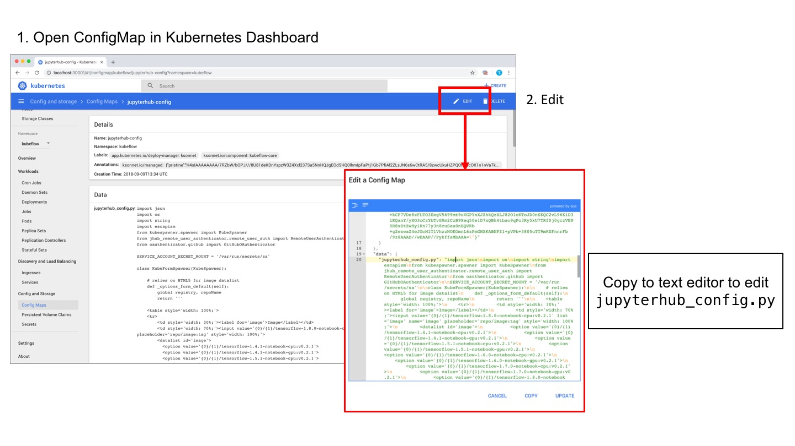

# Kubeflow Setup

[Back](README.md) | [Tool Guide](nvidia-tools.md) | [Sharing Guide](sharing.md)

[Kubeflow](https://github.com/kubeflow/kubeflow) is an open-source Cloud Native platform for machine learning. 

The Kubeflow project is dedicated to making deployments of machine learning workflows on Kubernetes simple, portable and scalable, providing a straightforward way to deploy systems for ML to diverse infrastructures. Kubeflow comes with several useful components, including JupyterHub, and has support for GPU-accelerated compute. Check out the official documentation at [kubeflow.org](http://kubeflow.org/).

### Page Index

1. Installing/Configuring Docker and Kubernetes (nvidia-distribution)
2. Installing Kubeflow with Minikube (Single Node Only!)
3. Installing Kubeflow on Kubernetes (Multiple Nodes)
4. Customising the Spawner GUI
5. Common Issues
   * GitHub Rate Limit
   * Kubernetes Dashboard
   * Common Dataset Volume
   * JupyterLab
   * No Internet access for Notebook
   * Culling Idle Notebook
   * Using NGC Images

## Installing Kubenetes

Prerequisites:

* `nvidia-docker` 2.0 is installed and properly configured
* User is added to the Docker group (allow Docker to run without sudo)

The official install guide for Kubernetes on NVIDIA GPUs (KONG) is [available from NVIDIA](https://docs.nvidia.com/datacenter/kubernetes-intall-guide/index.html).

However, we will not be following the full guide here.


To allow Kubeflow to work without issues, we have to set the default container runtime to NVIDIA's.

`sudo nano /etc/docker/daemon.json`

Add the following line **under the first level**:

```
"default-runtime": "nvidia",
```

Your file should end up looking something like this:

```
{
    "default-runtime": "nvidia",
    "runtimes": {
        "nvidia": {
            "path": "nvidia-container-runtime",
            "runtimeArgs": []
        }
    }
}
```

Do `sudo pkill -SIGHUP dockerd` to restart the Docker daemon.

To test: `docker run --rm nvidia/cuda nvidia-smi`

## Installing Kubeflow with Minikube (Single Node Only!)

[Minikube](https://github.com/kubernetes/minikube) is a tool that makes it easy to run Kubernetes locally on a single node. This is very useful if, for example, you can a 4 GPU machine (e.g. DGX Station) that you are sharing among a small team, or have many infrequent users that may need to use it (e.g. in a University).

### Install Minikube

Run the following commands:

```
curl -Lo minikube https://storage.googleapis.com/minikube/releases/latest/minikube-linux-amd64 && chmod +x minikube && sudo cp minikube /usr/local/bin/ && rm minikube
export MINIKUBE_WANTREPORTERRORPROMPT=false
export MINIKUBE_HOME=$HOME
export CHANGE_MINIKUBE_NONE_USER=true
export KUBECONFIG=$HOME/.kube/config
sudo -E minikube start --vm-driver=none --feature-gates=DevicePlugins=true
```

If all went well, you should see the following outout:

```
Starting local Kubernetes v1.10.0 cluster...
Starting VM...
Getting VM IP address...
Moving files into cluster...
Setting up certs...
Connecting to cluster...
Setting up kubeconfig...
Starting cluster components...
Kubectl is now configured to use the cluster.
===================
WARNING: IT IS RECOMMENDED NOT TO RUN THE NONE DRIVER ON PERSONAL WORKSTATIONS
	The 'none' driver will run an insecure kubernetes apiserver as root that may leave the host vulnerable to CSRF attacks


```

### Create the NVIDIA daemonset (driver)

`kubectl create -f https://raw.githubusercontent.com/NVIDIA/k8s-device-plugin/v1.10/nvidia-device-plugin.yml`

Output: `daemonset "nvidia-device-plugin-daemonset" created`

Check if the GPUs on your node can be accessed from minikube:

`kubectl get nodes -o=custom-columns=NAME:.metadata.name,GPUs:.status.capacity.'nvidia\.com/gpu'`

```
NAME       GPUs
minikube   4
```

### Install ksonnet

You might want to check the latest ksonnet release on the GitHub [releases page](https://github.com/ksonnet/ksonnet/releases).

```
wget https://github.com/ksonnet/ksonnet/releases/download/v0.12.0/ks_0.12.0_linux_amd64.tar.gz
tar -xzf ks_0.12.0_linux_amd64.tar.gz
sudo cp ks_0.12.0_linux_amd64/ks /usr/local/bin/
```

### Install Kubeflow using ksonnet

#### Environment Setup

```
# Create a namespace for kubeflow deployment
NAMESPACE=kubeflow
kubectl create namespace ${NAMESPACE}

# https://github.com/kubeflow/kubeflow/releases
VERSION=v0.2.5

# Initialize a ksonnet app. Set the namespace for its default environment.
APP_NAME=my-kubeflow
ks init ${APP_NAME}
cd ${APP_NAME}
ks env set default --namespace ${NAMESPACE}
```
#### Install Kubeflow components

```
ks registry add kubeflow github.com/kubeflow/kubeflow/tree/${VERSION}/kubeflow
ks pkg install kubeflow/core@${VERSION}
```

Only `core` is a **must** to install. The rest are extras:

* [tf-serving](https://github.com/tensorflow/serving): TensorFlow Serving
* [argo](https://github.com/argoproj/argo): Workflows for Kubernetes
* [katib](https://github.com/kubeflow/katib): Hyperparameter Tuning on Kubeflow
* [seldon](https://github.com/kubeflow/example-seldon): Deploy Models on Kubeflow
* [mpi-job](https://github.com/kubeflow/mpi-operator): Allreduce-style distributed training
* [pytorch-job](https://github.com/kubeflow/pytorch-operator): PyTorch Operator

```
ks pkg install kubeflow/tf-serving@${VERSION}
ks pkg install kubeflow/argo@${VERSION}
ks pkg install kubeflow/katib@${VERSION}
ks pkg install kubeflow/seldon@${VERSION}
ks pkg install kubeflow/mpi-job@${VERSION}
ks pkg install kubeflow/pytorch-job@${VERSION}
ks pkg install kubeflow/examples@${VERSION}
```

#### Final Steps

```
# Create templates for core components
ks generate kubeflow-core kubeflow-core

# Enable collection of anonymous usage metrics
# Skip this step if you don't want to enable collection.
ks param set kubeflow-core reportUsage true
ks param set kubeflow-core usageId $(uuidgen)
ks param set kubeflow-core jupyterHubServiceType NodePort
#ks param set kubeflow-core jupyterNotebookPVCMount "null"

# Deploy Kubeflow
ks apply default -c kubeflow-core
```

After running the setup steps, use `kubectl get pods -n kubeflow` to check if all the pods have been succesfully created.

To expose JupyterHub on your machine's IP address:

```
PODNAME=`kubectl get pods --namespace=${NAMESPACE} --selector="app=tf-hub" --output=template --template="{{with index .items 0}}{{.metadata.name}}{{end}}"`
kubectl expose pod $PODNAME --type=NodePort --name tf-service --namespace kubeflow
```

## Installing Kubeflow on Kubernetes (Multiple Nodes)

`TODO`

## Customising the Spawner GUI

The gist of it is edit the `jupyterhub-config` ConfigMap in order to change the configuration file that is loaded by JupyterHub (`jupyterhub_config.py`).

You may use the Kubernetes Dashboard:



Or `kubectl`:

```
kubectl edit configmap jupyterhub-config -n kubeflow
```

**To change the form itself, you need to edit the HTML5 content that is returned by `KubeFormSpawner._options_form_default()`.**

The rest of the file controls various other JupyterHub configuration.

### Remarks

* If you wish to use nano instead of the default `vim`, you can set the editor by prepending `KUBE_EDITOR="nano"` to the command above.
* For making complex changes to the file, it is recommended to open the ConfigMap in a proper editor, such as VS Code.
* [Sample `jupyterhub_config.py`.](kubeflow_files/demo_jupyterhub_config.py)
* KubeSpawner API Reference: [KubeSpawner](https://jupyterhub-kubespawner.readthedocs.io/en/latest/spawner.html#kubespawner)

## Common Issues

**Rate Limit from GitHub**

```
prepend a github token to the command
GITHUB_TOKEN=xxxXXXxxx ks <command>
```

**Kubernetes Dashboard**

Find out more about [Kubernetes Dashboard](https://kubernetes.io/docs/tasks/access-application-cluster/web-ui-dashboard/).

1. Minikube

```
sudo minikube dashboard &
```

The dashboard will be available on `localhost:30000`.

2. Other

Please see [Kubernetes Dashboard GitHub repository](https://github.com/kubernetes/dashboard).

**Common Dataset Volume**

To create a shared volume for datasets:

1. `wget https://raw.githubusercontent.com/NVAITC/workstation-setup-guide/master/kubeflow_files/dataset_volume.yaml`
2. `nano dataset_volume.yaml` and edit the volume size to your requirements
3. `kubectl create -f dataset_volume.yaml -n kubeflow`

Modify the `jupyterhub_config.py` file in `jupyterhub-config` ConfigMap:

```
# INSERT UNDER
# if pvc_mount and pvc_mount != 'null':
	....
	....
	volumes.append(
	        {
	            'name': 'volume-datasets',
	            'persistentVolumeClaim': {
	                    'claimName': 'claim-datasets'
	            }
	        }
	    )
	volume_mounts.append(
	        {
	            'mountPath': pvc_mount+'/datasets',
	            'name': 'volume-datasets'
	        }
	    )
	....
	....
```

**Using JupyterLab instead**

Replace `?tree` in the URL with `lab`. (Yes, it's that easy.)

**No Internet access from Jupyter Notebooks**

Apply the following config. You can do so via GUI (Kubernetes Dashboard)

```
apiVersion: v1
kind: ConfigMap
metadata:
  name: kube-dns
  namespace: kube-system
data:
  upstreamNameservers: |
    ["8.8.8.8"]
```

**Culling Idle Notebooks**

Add the following to the JupyterHub configmap.

```
c.JupyterHub.services = [
    {
        'name': 'wget-cull-idle',
        'admin': True,
        'command': ['wget', 'https://raw.githubusercontent.com/jupyterhub/jupyterhub/master/examples/cull-idle/cull_idle_servers.py', '-N']
    },

    {
        'name': 'cull-idle',
        'admin': True,
        'command': ['python', 'cull_idle_servers.py', '--timeout=3600']
    }
]
```

**NGC Images**

You may use our custom image built from the NGC images, which are fully optimised and test by NVIDIA for maximum performance on supported systems

* [`tlkh/pytorch-lab:0.1`](https://hub.docker.com/r/tlkh/pytorch-lab/)
* [`tlkh/tensorflow-lab:0.1 `](https://hub.docker.com/r/tlkh/tensorflow-lab/)


