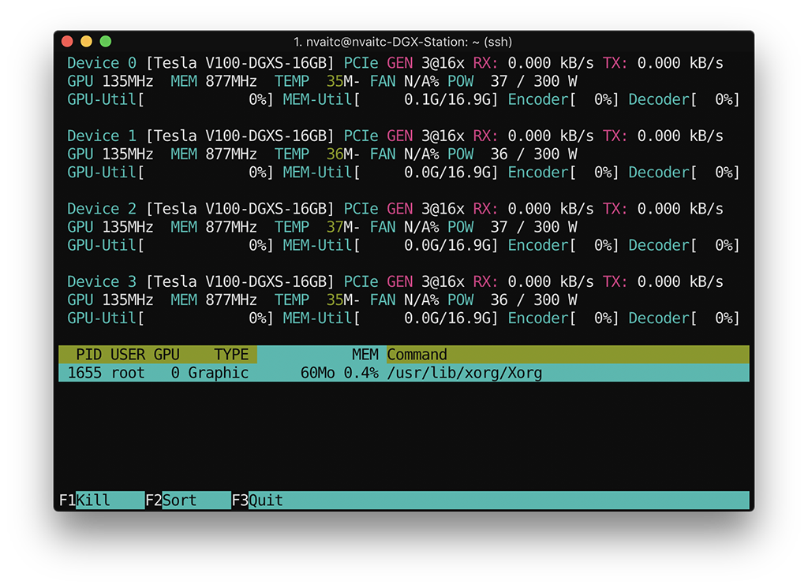
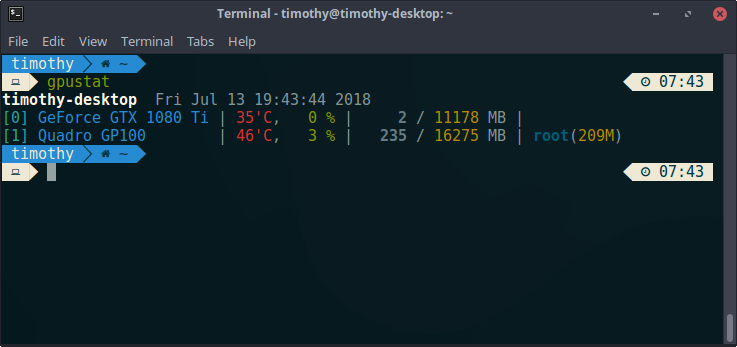
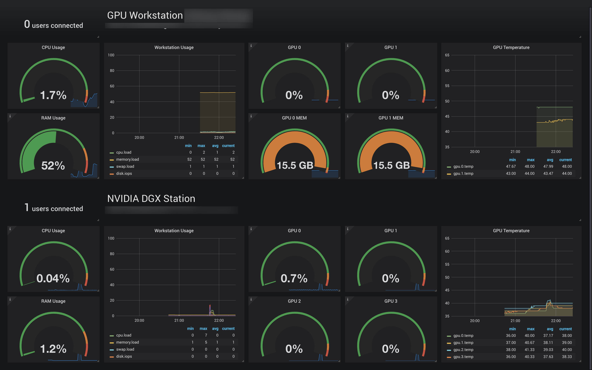

# NVIDIA Tools

Covers some of the useful NVIDIA tools for GPU management on Linux.

## Monitoring/System Information

- **`nvidia-settings`**

`nvidia-settings` is NVIDIA's graphical GPU management utility on Linux

To use `nvidia-settings` over SSH or from a system script (e.g. `rc.local`), prefix the command with `sudo DISPLAY=:0 XAUTHORITY=/var/run/lightdm/root/:0`. This will allow you to change `nvidia-settings` parameters on startup or over SSH.

- **`nvtop`**

`nvtop` is a very nice `htop`-like utility for tracking GPU usage.

Install it by following the instructions at the `nvtop` [GitHub repository](https://github.com/Syllo/nvtop).



- **`nvidia-smi`**

`nvidia-smi` is the default command line utility used to display a summary of the GPU utilisation on a system.

```
Mon Jul  9 19:34:47 2018
+-----------------------------------------------------------------------------+
| NVIDIA-SMI 396.26                 Driver Version: 396.26                    |
|-------------------------------+----------------------+----------------------+
| GPU  Name        Persistence-M| Bus-Id        Disp.A | Volatile Uncorr. ECC |
| Fan  Temp  Perf  Pwr:Usage/Cap|         Memory-Usage | GPU-Util  Compute M. |
|===============================+======================+======================|
|   0  GeForce GTX 108...  Off  | 00000000:01:00.0 Off |                  N/A |
| 44%   31C    P8     9W / 250W |      2MiB / 11178MiB |      0%      Default |
+-------------------------------+----------------------+----------------------+
|   1  Quadro GP100        Off  | 00000000:02:00.0  On |                  Off |
| 26%   40C    P0    30W / 235W |    234MiB / 16275MiB |      2%      Default |
+-------------------------------+----------------------+----------------------+

+-----------------------------------------------------------------------------+
| Processes:                                                       GPU Memory |
|  GPU       PID   Type   Process name                             Usage      |
|=============================================================================|
|    1      1141      G   /usr/lib/xorg/Xorg                           171MiB |
|    1      1853      G   compiz                                        36MiB |
+-----------------------------------------------------------------------------+
```

- **`gpustat`**

`gpustat` is a compact and powerful version of `nvidia-smi`. Install with `sudo pip3 install gpustat`.



## Monitoring Dashboard

`COMING SOON!!`

