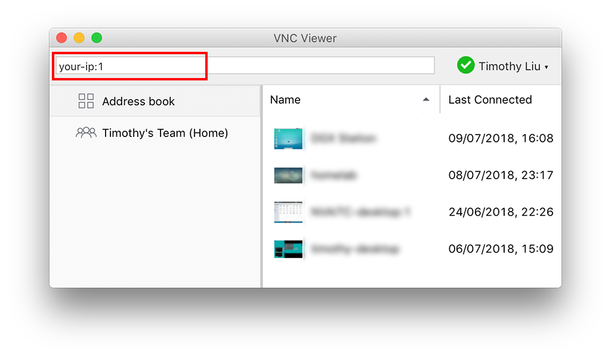
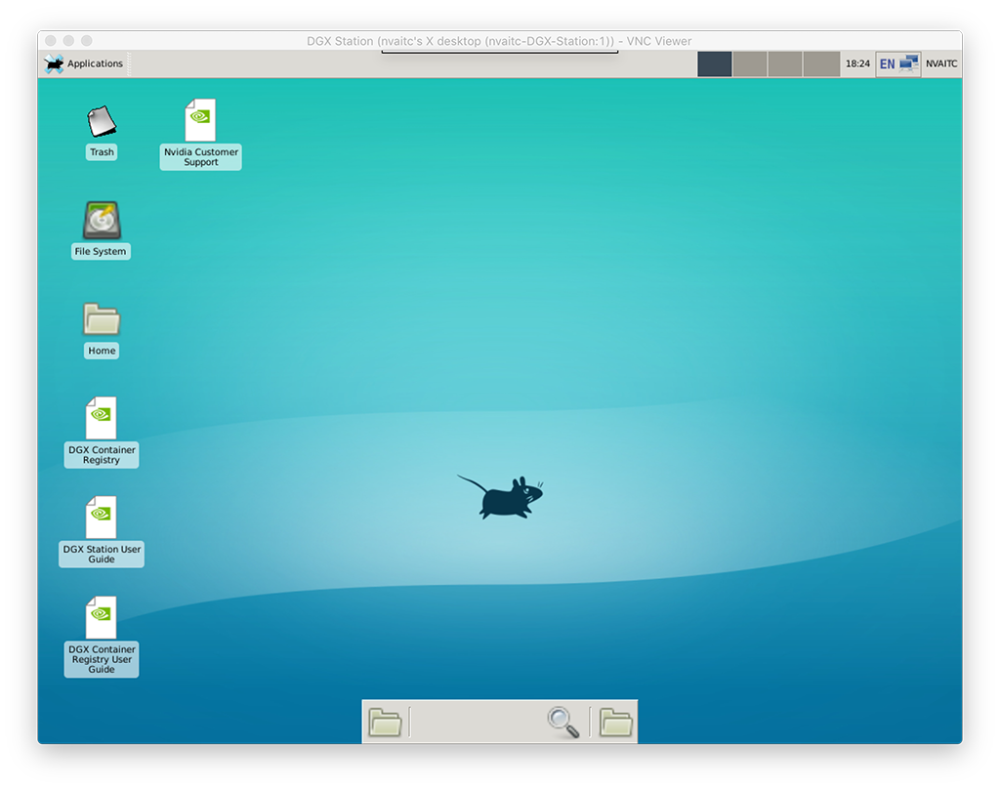
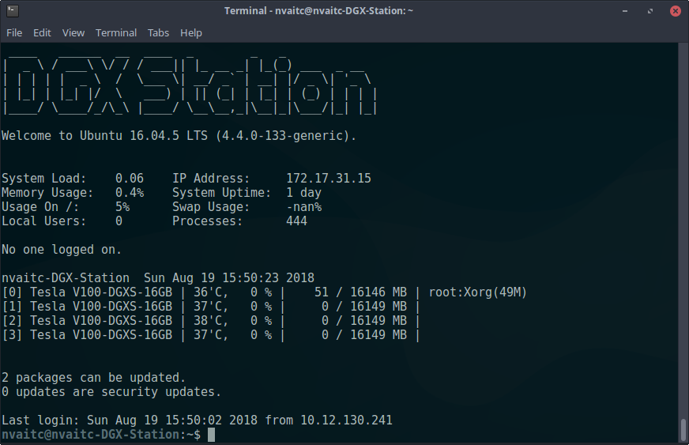

## Configuring remote desktop access (local network)

[Back](README.md) | [Tool Guide](nvidia-tools.md) | [Kubernetes/Kubeflow Guide](kubeflow-setup.md)

> Note: [Kubeflow](https://www.kubeflow.org/) is a very powerful solution to creating (among other things) a JupyterHub server on your workstation that you can use as a GUI to create isolated Jupyter Notebook enviroments, with access control. We document how to set that up [here](kubeflow-setup.md).

### 1. Setup

Remote command line access is provided by SSH (previously configured)

We will install a lightweight desktop enviroment (XFCE) and a VNC server to provide remote desktop capabilities.

`sudo apt install xfce4 xfce4-goodies tightvncserver`

Use the command `vncserver` to start the remote desktop service under your current user:

```
$ vncserver

New 'X' desktop is your-workstation:1

Starting applications specified in /home/nvaitc/.vnc/xstartup
Log file is /home/nvaitc/.vnc/your-workstation:1.log
```

On initial startup, you will be prompted to set a password for your user. Individual accounts on the workstation can each start individual remote desktops to be used simultaneously.

Use `vncserver -kill :1` to kill Desktop `:1`

After initial setup, kill the VNC server and replace the contents of the `xstartup` file:

`nano ~/.vnc/xstartup`

```
#!/bin/sh

xrdb $HOME/.Xresources
xsetroot -solid grey
#x-terminal-emulator -geometry 80x24+10+10 -ls -title "$VNCDESKTOP Desktop" &
#x-window-manager &
# Fix to make GNOME work
startxfce4 &
export XKL_XMODMAP_DISABLE=1
/etc/X11/Xsession
```

### 2. Connecting

On your client device (phone/tablet/laptop) download a VNC Client. [RealVNC Viewer](https://www.realvnc.com/en/connect/download/viewer/) works on all common platforms without an issue.

Connect by entering the ip-address of your workstation and the desktop number as follows:



Dismiss any security warning and enter in your password. You will then be presented with your remote desktop:



You can use the remote desktop to run Jupyter Notebook sessions in a persistent manner as the state of the desktop and applications will persist between connections.

Tab doesn't work: https://www.smork.info/blog/2015/06/10/fixing_bash_tab_completion_in_xfce.html

Set bash as default shell: `sudo usermod -s /bin/bash $USERNAME`

### 3. Bonus: SSH Message of the Day (MOTD)

This section is going to walk through how to create this kind of nice display upon login via SSH:


Steps:

```
sudo apt install lsb-release figlet update-motd finger
cd /etc/update-motd.d/
ls
```

This should show something similar to:

```
00-header     90-updates-available  98-fsck-at-reboot
10-help-text  91-release-upgrade    98-reboot-required
```

These are the script that print the messages shown when someone logs in via SSH. We want to replace some of them with something a little more useful/informative.

We're going to:

* add a nicer ASCII header to `00-header`
* add user login and GPU usage information to `10-help-text`

Simply replace those files with the files in the `/motd/` folder in this repository.


## Configuring remote access (via Internet)

### Reverse SSH Tunnel

This will allow you to expose your workstation's SSH and Jupyter Notebook on a public IP address. Naturally, this will come with some security risks. This guide does not fully address such risks.

For this, you require a small VPS/cloud instance with a public IP address.

Sample SSH command:

`nohup autossh -N -T -R :public-port:0.0.0.0:jupyter-port root@public-ip-address &`

Breakdown of this command:

* `nohup` allows the command to run after you disconnect ("no-hangup")
* `autossh` reconnects the tunnel if it disconnects for any reason. You'll need to setup SSH key-pair authentication for this to work seamlessly
* `&` tasks the autossh thread to run in the background
* [Breakdown of arguments](https://explainshell.com/explain?cmd=ssh+-N+-T+-R)

On your VPS/cloud instance, there's a need to edit the `/etc/ssh/sshd_config` file to add in the following line:

```
GatewayPorts clientspecified
```

### RealVNC Connect

We will use a commercial cloud VNC service called RealVNC Connect. The personal use subcription ("Home") allows cloud VNC connections to up to 5 computers on a user's RealVNC account.
